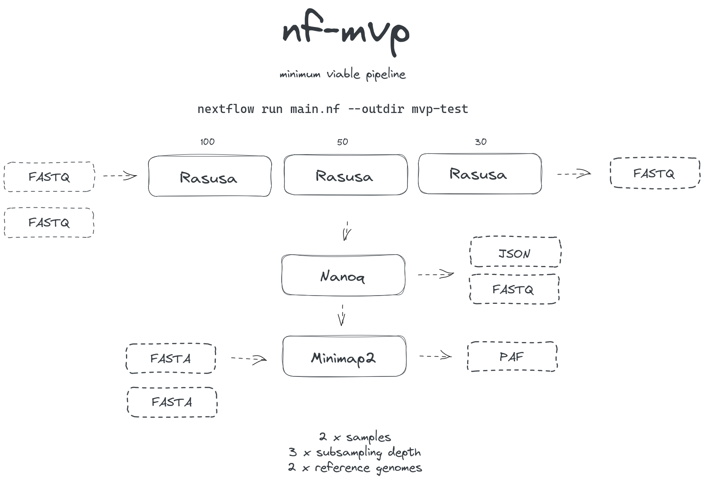

# Minimum viable pipeline in Nextflow

Scaffold for demonstration in the Bioinformatics Clinic session (2023-09-25)

## Build stages

I built the pipeline incrementally and commited at different stages, which are available as [branches of this repository](https://github.com/esteinig/nf-mvp/branches). Commit messages explain the main features and commit differences detail the exact changes. All commits were merged into `main` with a final stage [pull request](https://github.com/esteinig/nf-mvp/pull/1).

## Directory structure

Directory structure for a modular Nextflow pipeline:

- `env/`: dependency environments
  - `conda.yml`: base conda environment for local execution
- `test/`: test files for the workflow
- `lib/`: nextflow library folder
  - `process/`: nextflow process definitions (`.nf`)
  - `workflow/`: nextflow subworkflow definitions (`.nf`)
  - `utils.nf`: nextflow utility functions
- `main.nf`: nextflow main entry script
- `nextflow.config`: nextflow config file

## Schematic

Basic workflow for subsample - quality control - alignment of multiple samples against single reference.


Basic workflow extended for multiple samples at multiple subsampling depths against multiple references.



## Requirements

`Conda` or `Mamba` installation.

## Local setup

Clone directory for environment setup:

```
git clone https://github.com/esteinig/nf-mvp
```

Install and activate environment:

```
mamba env create -f nf-mvp/env/conda.yml && conda activate nf-mvp
```

Run the Nextflow with the `test` profile:

```
nextflow run nf-mvp/main.nf -profile test
```

## Repository execution

With latest `Nextflow` and `Conda` installed:

```
nextflow run -r 0.1.0 esteinig/nf-mvp -profile conda,test
```

With `Mamba` environment installer instead of `Conda`:

```
nextflow run -r 0.1.0 esteinig/nf-mvp -profile conda,test --mamba
```

## Command-line parameter examples

Ignoring other options for now, these are just some examples of how to use the workflow as a command-line application and parameterize its execution. All parameters used here are 
specified in the `nextflow.config` file at the base of the repository.


```bash
# Specify different output directory
nextflow run main.nf --outdir mvp-output

# Specify different subsampling values
nextflow run main.nf --subsample "100,50,10"

# Target different input files - note that paths containing
# wildcards must be wrapped in string quotation
nextflow run main.nf --fastq "/path/to/reads/*.fq" --fasta "/path/to/refs/*.fa"

# Provide resources for alignment process
nextflow run main.nf --minimap2.cpus 16 --minimap2.memory "8 GB"
```

## Tips and tricks

There are lots of different ways to do things, so these are highly opinionated tips for getting started.

0.  Consider whether you need a (rather complex) pipeline framework in the first place

1.  Assign a file-based identifier for input/output in all processes to keep track of the identity of the reads that are being processed.

    File paths have useful methods like `getSimpleName()`: https://www.nextflow.io/docs/latest/script.html#getting-file-attributes

2.  Be explicit in defining processes belonging to specific analysis modules.
    
    It is often easier to define a similar process (at the cost of verbosity) that meets
    the input/output requirements of a module than defining a generalized process that relies
    on channel operations to receive the correct input or produce the correct outputs.

3.  Channels and channel operators can be piped: https://www.nextflow.io/docs/latest/workflow.html#pipe

4.  Modularize workflows and processes into a library that can be reused: https://www.nextflow.io/docs/latest/workflow.html

5.  Define named output channels for flexible and consistent output schemas: https://www.nextflow.io/docs/latest/workflow.html#process-named-outputs 

    For tuple outputs with named emission use the parentheses pattern: `tuple (val(id), path("filtered.fq"), emit: reads)`

6. When testing a pipeline use a small input file that meets minimum criteria - iteration on channel operations and other more complex methods can be tested faster.

7. Tags with identifiers and parameters can be helpful in tracking progress on specific parameterized processes.

8. Develop simple workflows from the ground up e.g. in `main.nf`, modularize when tested.

## Resources mentioned in clinic

* Documentation: https://www.nextflow.io/docs/latest/getstarted.html and training excercises: https://training.nextflow.io/basic_training/ 
* Slack channel for Nextflow: https://nextflow.slack.com/signup#/domain-signup and issues section for searching questions https://github.com/nextflow-io/nextflow/issues 
* Running the workflow with the `-with-trace` parameter produces a trace file of the processes useful for debugging: https://www.nextflow.io/docs/latest/tracing.html#trace-report 
* Nextflow Tower as a frontend / monitoring server for workflows: https://tower.nf/ 
* Nextflow pattern collection (may be outdated for some): https://nextflow-io.github.io/patterns/optional-input/ 
## Dependencies

- [`Nextflow`](https://github.com/nextflow-io/nextflow)
- [`Rasusa`](https://github.com/mbhall88/rasusa)
- [`Nanoq`](https://github.com/esteinig/nanoq)
- [`minimap2`](https://github.com/lh3/minimap2)
